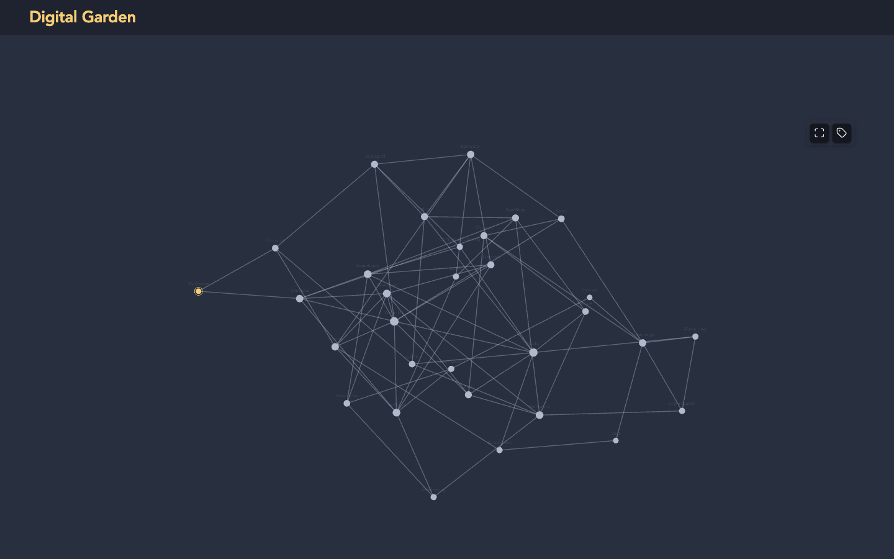

# Home Graph

A [Digital Garden](https://github.com/oleeskild/digitalgarden) plugin that
turns your garden's home page into the global graph: every published note is
a node, every link between notes is an edge, and clicking a node opens the
note. Drag nodes around, scroll to zoom, hover to highlight a note's
neighbours.



The graph uses the same d3 + Pixi renderer stack and the same `--dg-graph-*`
theme variables as the garden's built-in local graph, so it follows your
theme and any graph colours you have customised. Notes marked `dg-hide` or
`dg-hide-in-graph` are left out, exactly like in the core graph.

## Install

Paste this repository's URL into the garden plugin installer in Obsidian, or
copy the plugin directory into `src/plugins/home-graph/` of your garden repo.

You still need a home note (`dg-home: true`): the graph is rendered on that
page. With the default settings the note's title and body are hidden and the
graph fills the page, so the home note can be empty.

## Settings

| Setting | Default | Description |
| --- | --- | --- |
| Placement | `replace` | `replace`: the graph *is* the home page; the note's title and content are hidden. `above` / `below`: the graph is shown together with the home note's content. |
| Height | `calc(100vh - 8rem)` | CSS height of the graph area, e.g. `80vh` or `600px`. |
| Always show titles | off | Show every note title at all zoom levels. When off, titles fade in as you zoom and on hover, like the core graph. The tag button on the graph toggles this for the current visit. |
| Hide sidebar on home page | on | Hide the right-hand sidebar (local graph, table of contents, backlinks) on the home page. |

Every setting can also be set through an environment variable in your
garden's `.env`: `HOME_GRAPH_PLACEMENT`, `HOME_GRAPH_HEIGHT`,
`HOME_GRAPH_SHOW_LABELS`, `HOME_GRAPH_HIDE_SIDEBAR`.

## Notes

- In `replace` mode everything the home note itself renders is hidden. Markup
  that other plugins inject into the home page's `index.*` slots is hidden
  too, unless the element carries a `data-home-graph-keep` attribute.
- The graph is only loaded on the home page; other pages are untouched.
- Nothing is bundled: d3 and Pixi are loaded from jsDelivr, the same CDN and
  versions the garden template already uses.

## Development

```
node --test test/*.node-test.mjs
```

Copy the directory into `src/plugins/home-graph/` of a
[digitalgarden](https://github.com/oleeskild/digitalgarden) checkout and run
`npm run dev` to try it.
